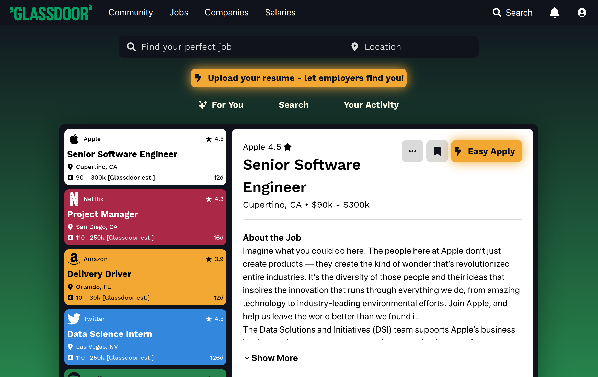

# Glassdoor Job Page Design Mockup 

Hey there!

This is a mockup page I built in an attempt to improve upon Glassdoor's job search page as an ideation exercise.

[**Click here to access it!**](https://glassdoor-mockup.vercel.app/)

### 🩹 Things It Addresses 

1. **Add color.** Job searching can be a bit of a slog; adding some color helps keep the user engaged! Our brains *love* color.
2. **Minimization of information.** It's very difficult to parse through so many listings, especially with job descriptions being as long as they usually are. Putting the briefest, most relevant information at the top of the job preview pane helps the user skim for information much easier, allowing for a better search experience. 
3. **Feature emphasis.** Glassdoor's resume scanning feature is awesome; the buttons to access it have been made very appealing and visible to encourage the user to click them.

### ✏️ Notes

*This is by no means a complete product!* It was built in a day, and is meant to serve as a proof-of-concept only.

---

**Built by Rafa with ❤️**
